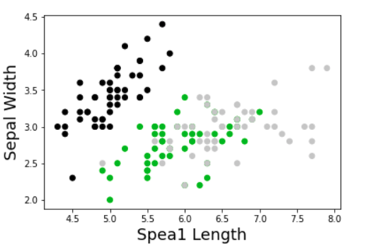

# kmeans
kmeans clustering implementation for cmput340 


# Introduction 
For this project I decided to implemented kmeans clustering.
Kmeans clustering is a form of unsupervised learning where we try to disover underlying patterns in the dataset and predict the the target labels of the dataset. 
Kmeans achieves this by clustering the data into different groups. 

# Implementation

### The dataset

For demonstration I will be using the Iris dataset provided by sklearn. The dataset contains two features; Sepal length and Sepal width and three target labels:
setosa, versicolor, and virginica. From the scatter plot we can see that these three target groups somewhat form their own clusters. With kmeans we would like to predict these same clusterings with our predicted labels. 

 
 
### The Algorithm
 
The kmeans algorithm is an iterative procces which attempts to partition our dataset into k clusters where each datapoint belongs to a cluster with nearest mean.

1. First we need to determine our k. for this instance we want k=3 since we have observed 3 somewhat distinct groups in the dataset and we have 3 labels. 

2. Next we must initialize our three centroids. The centroids are our three Means, each data point will be classified based on which centroid it is closest to:
```python:
    k = 3
    n_iter = 300
    n = X.shape[0]
    m = X.shape[1]
    
   centroids = np.zeros((m, k)) 
   for i in range(0,k):
   centroids[:,i] = X[np.random.randint(0,n)]
    
 ```
 3. With our three random centroids we now calculate each datapoints distance from each centroid and store it in a distance matrix. We can calculate the distances by   computing the 2-norm/Euclidean distance of each data point. after calculated distances we asign each data point to a centroid to which it is closest to and encode    it in our points vector:

```python:
   distances=np.zeros((n,k))
   for i in range(0,k):
     c = centroids[:,i]
     norm = np.linalg.norm(X-c, axis=1)
     distances[:,i] = norm
    
    points = np.array([np.argmin(i) for i in distances]) 

```

4. From here we iterativly repeat steps 2 and 3 except our centroids are initialized by finding the mean values of datapoints in each group. This is similiar to   gradient descent with the process of minimizing a cost function J iteratively where our J can be seen as the sum of 2-norm distances. According to a reasearch paper by google, for practical solutions, kmeans will converge after 20-50 iterations. With this in mind, I decided to go with 300 iterations because you can never be too safe. 

```python:
for i in range(n_iter):
    centroids = np.zeros((k,2))
    for i in range(k):
        c = X[points==i].mean(axis=0)
        centroids[i] = c
    
    for i in range(0,k):
        c = centroids[i]
        norm = np.linalg.norm(X-c, axis=1)
        distances[:,i] = norm
```

### Results
  
